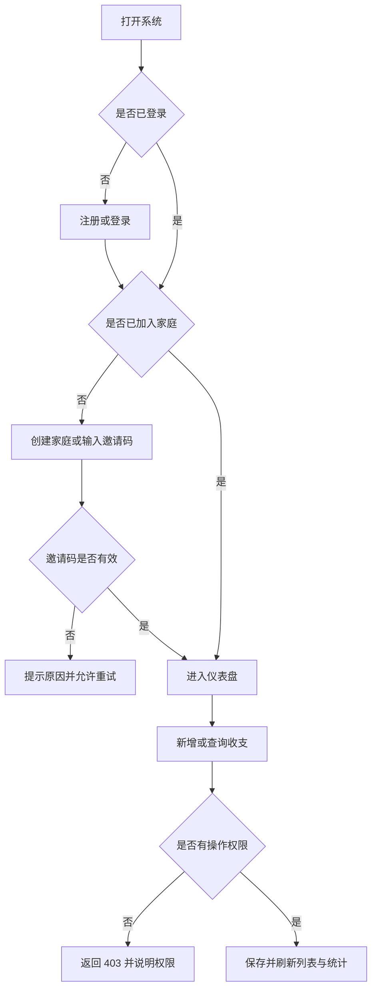

# 家庭理财系统产品需求文档（PRD）

## 1. 产品概述

### 1.1 一句话定位

面向家庭成员的前后端分离 Web 课设系统，用于在家庭范围内安全记录个人收支、管理成员与分类，并查看家庭聚合统计。

### 1.2 产品形态与价值

- **形态**：本机运行的 B/S Web 应用，Vue 浏览器端访问 Spring Boot 服务端。
- **核心用户**：家庭家长、普通家庭成员、课程验收教师。
- **用户价值**：家庭成员各自记账，家长统一管理，家庭共享统计而不暴露普通成员以外的明细操作权限。
- **课程价值**：完整展示需求分析、角色权限、数据库设计、CRUD、统计图表、前后端分离和软件测试。
- **商业目标**：无。本项目是课程设计，不设计付费、增长或运营体系。

### 1.3 范围边界

第一版实现注册登录、创建或加入家庭、角色权限、成员管理、分类管理、收支管理和统计仪表盘。不实现预算、通知、附件、导入导出、未来流水、多家庭切换、公网部署、银行/支付平台连接和投资分析。

## 2. 角色与典型场景

| 角色 | 主要目标 | 权限摘要 |
|---|---|---|
| 家长 `PARENT` | 管理家庭与全家收支 | 查看和维护本家庭全部成员、分类、流水和统计 |
| 普通成员 `MEMBER` | 维护个人收支并了解家庭总体情况 | 查看成员名单与家庭聚合统计；仅查看和维护本人流水、本人资料 |
| 未入户用户 | 完成家庭归属 | 只能创建家庭或通过邀请码加入家庭 |

典型场景：

1. 用户注册后创建家庭，系统将其设为家长并生成邀请码。
2. 第二位用户注册后使用邀请码加入，系统自动生成家庭内成员编号并设为普通成员。
3. 两位成员分别记录收入和支出，普通成员只能看到本人明细，家长能查看全家明细。
4. 家庭成员通过仪表盘查看本月收支、结余、趋势、类别构成和成员对比。

## 3. 核心用户动线



## 4. 功能清单

```text
家庭理财系统
├── 核心：注册、登录、退出与会话恢复
├── 核心：创建家庭、邀请码加入、邀请码重置
├── 核心：家长/普通成员角色与家庭数据隔离
├── 核心：成员编号、姓名、角色、状态管理
├── 核心：预置分类与家庭自定义分类管理
├── 核心：收入/支出新增、查询、修改、删除
├── 核心：本月指标、12 月趋势、类别占比、成员对比
├── 重要：个人资料与密码修改
└── 不在第一版：预算、提醒、附件、导出、多家庭、公网部署
```

## 5. 页面与交互规格

### 5.1 页面清单

| 路由 | 页面 | 访问条件 | 核心内容 |
|---|---|---|---|
| `/login` | 登录 | 未登录 | 用户名、密码、注册入口 |
| `/register` | 注册 | 未登录 | 用户名、姓名、密码、确认密码 |
| `/onboarding` | 入户 | 已登录且未入户 | 创建家庭、邀请码加入 |
| `/dashboard` | 仪表盘 | 已入户 | KPI、趋势、构成、成员对比、最近流水 |
| `/entries` | 收支管理 | 已入户 | 筛选、分页、表格/移动卡片、编辑抽屉 |
| `/members` | 成员管理 | 已入户 | 名单；家长可修改、停用、恢复 |
| `/categories` | 分类管理 | 已入户 | 收入/支出页签；家长管理自定义分类 |
| `/profile` | 个人资料 | 已入户 | 姓名与密码修改 |

### 5.2 仪表盘线框图

```text
┌──────────────────────────────────────────────────────────────┐
│ Logo  [概览][收支明细][家庭成员][收支分类]          [头像菜单] │
├──────────────────────────────────────────────────────────────┤
│ 欢迎回来，姓名 · 家庭名称                         [+ 记一笔] │
├───────────────┬─────────────────────────┬────────────────────┤
│ 收支构成      │ 近 12 月收入/支出趋势    │ 本月收入           │
│ 半圆/环形图   │                         ├────────────────────┤
│               │                         │ 本月支出           │
├───────────────┤                         ├────────────────────┤
│ 成员收支对比  │                         │ 本月结余           │
├───────────────┴─────────────────────────┴────────────────────┤
│ 最近收支记录（成员 / 类型 / 类别 / 日期 / 金额）             │
└──────────────────────────────────────────────────────────────┘
```

### 5.3 通用状态

| 状态 | UI 表现 | 用户操作 |
|---|---|---|
| 加载中 | 与最终布局一致的骨架屏；提交按钮进入 loading | 等待，不可重复提交 |
| 空数据 | 简短说明 + 唯一主操作，例如“记录第一笔收支” | 创建数据 |
| 成功 | 轻量成功提示并刷新当前数据 | 继续使用 |
| 校验失败 | 字段下方显示具体原因 | 修改后重试 |
| 接口失败 | 页面原位错误或消息提示，保留已填内容 | 重试 |
| 未登录 | 清理本地认证状态并跳转登录 | 重新登录 |
| 无权限 | 显示 403 与返回入口；后端同时拒绝请求 | 返回可访问页面 |
| 危险操作 | 弹窗说明对象与影响 | 取消或确认 |

## 6. 功能与数据规则

### 6.1 注册与登录

- 用户名 4–32 位，只允许字母、数字和下划线，系统全局唯一。
- 姓名 1–40 个字符；密码 8–72 个字符，必须同时包含字母和数字。
- 密码只保存 BCrypt 摘要。登录成功创建服务端会话；停用用户不能登录。
- 所有修改请求必须携带有效 CSRF Token。

### 6.2 家庭与成员

- 一个账号第一版只能属于一个家庭；创建家庭者成为家长。
- 邀请码为不可预测的 8 位大写字母和数字组合，全局唯一；家长可重置，旧码立即失效。
- 成员编号按 `M001` 起自动生成，家庭内唯一；家长可修改。
- 家长可修改成员姓名、编号和角色，可停用或恢复成员。
- 最后一名活跃家长不得被降级或停用；用户不能通过修改请求越权操作其他家庭成员。
- 停用成员不能登录，历史流水继续参与原时间范围统计。

### 6.3 分类

- 分类类型仅为 `INCOME` 或 `EXPENSE`，名称 1–30 个字符。
- 系统预置分类对所有家庭可见且不可编辑。
- 家长可新增、改名、停用和恢复本家庭分类；普通成员只读。
- 已停用分类不能用于新流水，但历史流水仍正常展示与统计。

### 6.4 收支

| 字段 | 类型/限制 | 必填 | 规则 |
|---|---|---|---|
| 归属成员 | 家庭成员 ID | 是 | 普通成员被强制为本人；家长可选本家庭成员 |
| 类型 | `INCOME/EXPENSE` | 是 | 必须与分类类型一致 |
| 分类 | 分类 ID | 是 | 必须为系统分类或本家庭启用分类 |
| 金额 | `DECIMAL(12,2)` | 是 | 大于 0，最多两位小数 |
| 发生日期 | 日期 | 是 | 不晚于当前本地日期 |
| 备注 | 0–255 字符 | 否 | 保存前去除首尾空格 |

- 普通成员只能查询、修改、删除本人流水；家长可操作本家庭全部流水。
- 删除为逻辑删除，列表与统计立即排除该记录。
- 列表默认按发生日期和创建时间倒序，每页 20 条，支持日期、类型、类别和成员筛选。

### 6.5 统计

- 选定时间范围内计算总收入、总支出与结余（收入减支出）。
- 趋势固定返回截止日期所在月份及之前共 12 个月数据，无数据月份补零。
- 类别构成分别按收入、支出聚合。
- 成员对比返回每名成员的收入、支出和结余。
- 普通成员可看家庭聚合结果，但统计接口不返回其他成员单笔明细。

## 7. 视觉与文案规范

- 登录/注册页采用 Lumina Hero 的浅灰、品牌蓝和深色主按钮气质，不使用外部视频。
- 登录后采用 Workora 顶部胶囊导航与白色大圆角应用壳；仪表盘使用 Bento Grid。
- 品牌蓝 `#466BF5`，深色 `#0A102E`，收入绿，支出珊瑚红；外壳/卡片/控件圆角为 30/18/12px。
- 文案风格为“专业但亲切、简洁直接”。按钮使用动作词，例如“创建家庭”“记录收支”；错误提示说明原因和下一步。
- Hero Video Dialog 不进入第一版。
## 8. 非功能与验收需求

- 桌面 Chrome/Edge 为主要验收环境，同时适配平板和手机宽度。
- 在课程演示数据规模下，列表和统计接口本机响应目标小于 500ms；页面不依赖公网资源。
- 密码摘要、服务端鉴权、CSRF、参数校验和家庭级数据隔离必须有效。
- 后端构建测试、前端类型检查/测试/生产构建必须通过；完整演示动线必须从当前源码运行成功。
