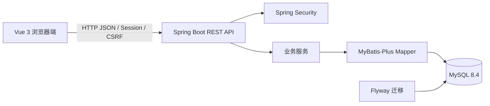

# 家庭理财系统架构设计

## 1. 架构目标

本架构服务于课程设计的最小完整闭环：结构清楚、权限可验证、能够本机启动和写入设计报告。它不是生产金融架构，不为未知规模预留微服务、缓存、队列或高可用设施。

## 2. 技术架构



| 层 | 选型 | 用途 |
|---|---|---|
| 前端 | Vue 3.5、Vite 8、TypeScript | SPA、路由、类型约束 |
| UI | Element Plus、ECharts、lucide-vue-next | 表单表格、统计图、图标 |
| 后端 | Java 17、Spring Boot 3.5、Spring MVC | REST API 与业务入口 |
| 权限 | Spring Security、服务端 Session、CSRF | 登录、角色和请求保护 |
| 持久化 | MyBatis-Plus 3.5、Flyway | CRUD、聚合 SQL、Schema 版本 |
| 数据库 | MySQL 8.4 | 业务持久化 |
| 测试 | JUnit、Spring Security Test、Testcontainers、Vitest | 权限、数据隔离、统计和前端状态 |

开发期由 Vite 将 `/api` 代理至后端，浏览器保持同源交互，避免额外的 CORS 与跨站 Cookie 配置。系统本机运行一个前端进程、一个后端进程和现有 MySQL 服务。

## 3. 代码与模块边界

```text
backend/
└── src/main/java/.../
    ├── common/       # 错误模型、异常处理、分页、当前用户上下文
    ├── auth/         # 注册、登录、退出、会话身份
    ├── household/    # 家庭、邀请码、成员与角色
    ├── category/     # 系统与家庭分类
    ├── ledger/       # 收支与筛选
    ├── budget/       # 月度总预算和分类预算
    ├── recurring/    # 周期模板与按月生成记录
    ├── audit/        # 家长可见的关键操作日志
    ├── statistics/   # 聚合查询与仪表盘 DTO
    └── profile/      # 本人资料与密码

frontend/
└── src/
    ├── api/          # Axios 客户端与模块 API
    ├── stores/       # 认证与会话状态
    ├── router/       # 路由与权限守卫
    ├── layouts/      # Style C 应用壳与认证布局
    ├── components/   # 可复用表单、状态、图表与控件
    ├── views/        # 月报、流水、预算、家庭、分类、周期、日志、资料及认证/状态页
    ├── types/        # API DTO 类型
    └── styles/       # Token、全局样式、Element Plus 覆盖
```

各业务模块纵向包含 Controller、Service、Mapper、DTO 和测试。Controller 只处理 HTTP 与校验，Service 负责权限和事务，Mapper 只负责当前家庭范围内的数据访问。前端采用 Style C“家庭月报”视觉：米白纸张与墨色为基底，群青、朱红和竹青分别表达品牌/结余、重点操作与收入状态；登录页使用仓库内的 `frontend/public/images/login-ledger-paper-v1.png` 装饰背景，`/login` 隐藏左上品牌标记，其他认证页保留品牌。

## 4. 数据模型

```mermaid
erDiagram
    HOUSEHOLD ||--o{ APP_USER : contains
    HOUSEHOLD ||--o{ FINANCE_CATEGORY : owns
    HOUSEHOLD ||--o{ LEDGER_ENTRY : owns
    APP_USER ||--o{ LEDGER_ENTRY : member
    FINANCE_CATEGORY ||--o{ LEDGER_ENTRY : classifies
    HOUSEHOLD ||--o{ MONTHLY_BUDGET : configures
    FINANCE_CATEGORY o|--o{ MONTHLY_BUDGET : targets
    HOUSEHOLD ||--o{ RECURRING_TEMPLATE : owns
    APP_USER ||--o{ RECURRING_TEMPLATE : member
    FINANCE_CATEGORY ||--o{ RECURRING_TEMPLATE : classifies
    RECURRING_TEMPLATE ||--o{ RECURRING_GENERATION : generates
    LEDGER_ENTRY ||--o{ RECURRING_GENERATION : materializes
    HOUSEHOLD ||--o{ AUDIT_LOG : records
    APP_USER ||--o{ AUDIT_LOG : acts

    HOUSEHOLD {
      bigint id PK
      varchar name
      varchar invite_code UK
      bigint created_by
      datetime created_at
      datetime updated_at
    }
    APP_USER {
      bigint id PK
      bigint household_id FK nullable
      varchar username UK
      varchar password_hash
      varchar display_name
      varchar member_no
      varchar role
      varchar status
      datetime created_at
      datetime updated_at
    }
    FINANCE_CATEGORY {
      bigint id PK
      bigint household_id FK nullable
      varchar scope
      varchar type
      varchar name
      varchar status
      datetime created_at
      datetime updated_at
    }
    LEDGER_ENTRY {
      bigint id PK
      bigint household_id FK
      bigint member_id FK
      bigint category_id FK
      varchar type
      decimal amount
      date occurred_on
      varchar note
      boolean deleted
      datetime created_at
      datetime updated_at
    }
    MONTHLY_BUDGET {
      bigint id PK
      bigint household_id FK
      date budget_month
      bigint category_id FK "nullable for total budget"
      decimal amount
      datetime created_at
      datetime updated_at
    }
    RECURRING_TEMPLATE {
      bigint id PK
      bigint household_id FK
      bigint member_id FK
      bigint category_id FK
      varchar type
      decimal amount
      tinyint day_of_month
      varchar note
      varchar status
      datetime created_at
      datetime updated_at
    }
    RECURRING_GENERATION {
      bigint id PK
      bigint recurring_template_id FK
      date generated_month
      bigint ledger_entry_id FK
      datetime created_at
    }
    AUDIT_LOG {
      bigint id PK
      bigint household_id FK
      bigint actor_id FK
      varchar action
      varchar object_type
      bigint object_id "nullable"
      varchar summary
      datetime created_at
    }
```

关键约束：

- `app_user.username` 全局唯一；`(household_id, member_no)` 家庭内唯一。
- `household.invite_code` 全局唯一。
- 自定义分类在同一家庭、同一类型下名称唯一；系统分类的 `household_id` 为空。
- 金额使用 `DECIMAL(12,2)`，Java 使用 `BigDecimal`，不使用浮点数。
- 流水保留 `household_id`，所有查询先按家庭过滤，再应用角色规则。
- 当前最终 Schema 由 Flyway V1 的 `household`、`app_user`、`finance_category`、`ledger_entry` 四张基础表，加上 V2 的 `monthly_budget`、`recurring_template`、`recurring_generation`、`audit_log` 四张增强表组成，共八张业务表。
- `monthly_budget` 按家庭和自然月保存总预算或支出分类预算；总预算用 `category_id IS NULL` 表示，同一家庭、月份和分类键唯一，月份固定为当月第一天。
- `recurring_generation` 对 `(recurring_template_id, generated_month)` 建唯一约束，保证用户触发的按月生成幂等；发生日超过月底时收敛到当月最后一天。
- `audit_log` 保存家庭关键业务变更的操作者、动作、对象和摘要；读取接口仅家长可用，流水统计仍直接聚合未删除明细，不建立汇总表。

## 5. 权限模型

| 操作 | 未入户用户 | 普通成员 | 家长 |
|---|---:|---:|---:|
| 创建/加入家庭 | 允许 | 禁止 | 禁止 |
| 查看家庭成员名单 | 禁止 | 允许 | 允许 |
| 修改成员、角色、状态 | 禁止 | 禁止 | 允许 |
| 查看分类 | 禁止 | 允许 | 允许 |
| 管理家庭分类 | 禁止 | 禁止 | 允许 |
| 查看本人流水 | 禁止 | 允许 | 允许 |
| 查看他人流水 | 禁止 | 禁止 | 允许 |
| 修改本人流水 | 禁止 | 允许 | 允许 |
| 修改他人流水 | 禁止 | 禁止 | 允许 |
| 查看家庭聚合统计 | 禁止 | 允许 | 允许 |
| 查看预算执行 | 禁止 | 允许 | 允许 |
| 维护家庭/分类预算 | 禁止 | 禁止 | 允许 |
| 管理本人周期模板 | 禁止 | 允许 | 允许 |
| 管理他人周期模板 | 禁止 | 禁止 | 允许 |
| CSV 导入/导出 | 禁止 | 允许（仅本人范围） | 允许（家庭范围） |
| 查看操作日志 | 禁止 | 禁止 | 允许 |

后端从已认证用户读取家庭和角色，客户端请求体不包含可信 `householdId`。成员 ID、分类 ID、流水 ID 每次使用前都要验证属于当前家庭。前端隐藏无权限操作只用于体验，不能替代后端鉴权。

## 6. REST 接口契约

| 模块 | 方法与路径 | 说明 |
|---|---|---|
| 认证 | `GET /api/auth/csrf` | 初始化 CSRF Cookie/Token |
| 认证 | `POST /api/auth/register` | 创建未入户账号 |
| 认证 | `POST /api/auth/login`、`POST /api/auth/logout` | 创建/销毁会话 |
| 认证 | `GET /api/auth/me` | 返回当前用户、角色、家庭状态 |
| 家庭 | `POST /api/households`、`POST /api/households/join` | 创建或加入家庭 |
| 家庭 | `GET /api/households/current` | 当前家庭信息 |
| 家庭 | `POST /api/households/invite-code/rotate` | 家长重置邀请码 |
| 成员 | `GET /api/members` | 当前家庭成员列表 |
| 成员 | `PATCH /api/members/{id}` | 修改编号、姓名或角色 |
| 成员 | `PATCH /api/members/{id}/status` | 停用或恢复 |
| 分类 | `GET/POST /api/categories` | 查询或新增分类 |
| 分类 | `PATCH /api/categories/{id}` | 改名 |
| 分类 | `PATCH /api/categories/{id}/status` | 停用或恢复 |
| 收支 | `GET/POST /api/entries` | 分页筛选或新增 |
| 收支 | `PUT/DELETE /api/entries/{id}` | 修改或逻辑删除 |
| 收支 | `GET /api/entries/export` | 导出当前权限和筛选范围内的 CSV |
| 收支 | `POST /api/entries/import/preview`、`/commit` | 预览校验与原子导入 |
| 预算 | `GET /api/budgets`、`PUT/DELETE /api/budgets/...` | 查看预算执行；家长维护额度 |
| 周期 | `GET/POST/PUT/DELETE /api/recurring-templates` | 模板管理 |
| 周期 | `POST /api/recurring-templates/generate` | 指定月份幂等生成 |
| 日志 | `GET /api/audit-logs` | 家长分页查看关键操作 |
| 统计 | `GET /api/statistics/dashboard` | 返回全部仪表盘数据 |
| 资料 | `PATCH /api/profile` | 修改本人姓名 |
| 资料 | `PUT /api/profile/password` | 校验旧密码后更新密码 |

成功响应统一为 `{ "data": ... }`。错误响应为 `{ "code": "STABLE_CODE", "message": "中文说明", "fieldErrors": { ... } }`，并使用 400、401、403、404、409 等真实 HTTP 状态。

## 7. 关键数据流与事务

1. **创建家庭**：锁定当前用户未入户状态 → 创建家庭与邀请码 → 为用户分配 `M001/PARENT` → 提交同一事务。
2. **邀请码加入**：查询邀请码 → 锁定家庭成员编号序列 → 生成下一个编号 → 更新用户归属与角色 → 提交事务。
3. **修改成员角色/状态**：校验操作者为家长 → 校验目标在本家庭 → 若影响家长则统计剩余活跃家长 → 满足约束后更新。
4. **保存流水**：按会话确定家庭 → 校验成员、分类、类型和权限 → 保存 → 统计由查询实时聚合，不维护重复汇总表。
5. **删除流水**：校验可操作范围 → 逻辑删除 → 后续列表和统计统一过滤 `deleted = false`。
6. **维护预算**：家长按月份写入或删除总预算/支出分类预算；普通成员只读预算执行，预算变更与审计记录在同一事务中完成。
7. **生成周期流水**：用户在页面指定月份触发生成，无后台调度器；模板先校验成员、分类和到期日，再写入流水与月度生成标记，唯一约束处理重复请求。
8. **CSV 导入导出**：导出复用当前家庭和角色筛选；预览只校验不写库，提交时服务端重新解析、校验校验和并在事务内整批写入，错误行不产生部分数据。
9. **增强统计与审计**：仪表盘在基础聚合上返回等长上期环比、储蓄率、预算执行和异常支出；关键业务写操作记录家长可见审计日志。

## 8. 安全、性能与可恢复性

- BCrypt 保存密码，Session Cookie 使用 HttpOnly；本机开发使用 SameSite=Lax。
- 所有写接口启用 CSRF，所有 DTO 使用 Bean Validation，异常统一收敛。
- 列表分页，每页默认 20、最大 100；统计 SQL 只扫描当前家庭和指定时间范围。
- 关键索引覆盖家庭、日期、成员、类型和分类组合查询。
- 用户、成员和分类采用状态停用；流水采用逻辑删除，避免不可恢复操作。
- 不记录密码、Cookie、数据库密码和完整异常堆栈到用户可见响应。

## 9. 架构停止条件

若实现不需要当前消费者，不新增接口、抽象、服务或表。只有任务书验收失败、测试证明当前模型不足，或用户明确扩展需求时才调整架构。
