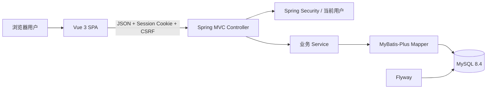
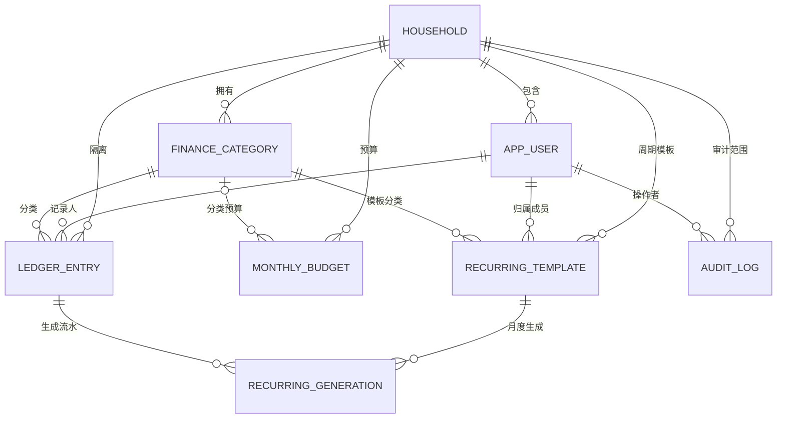
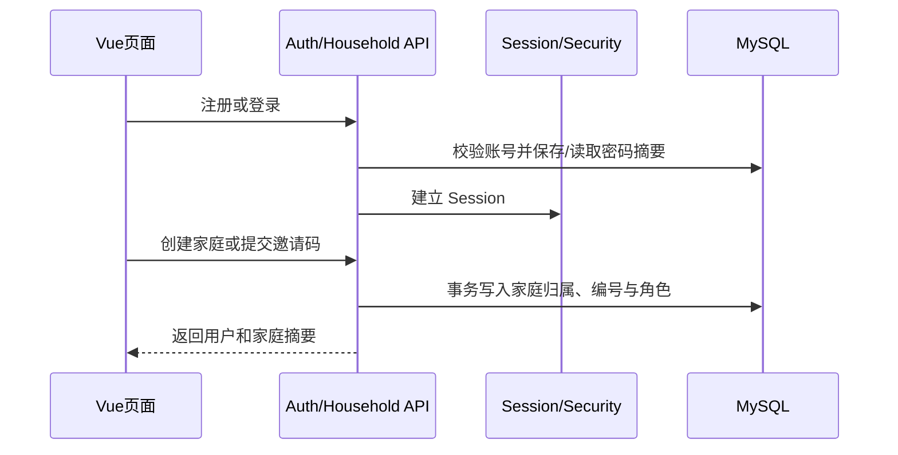
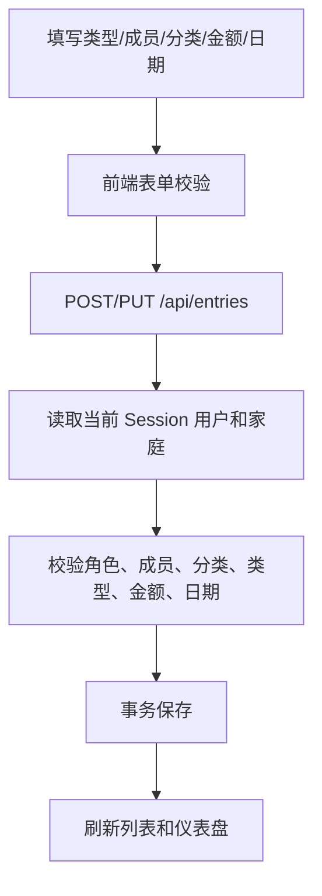

# 家庭理财系统整体架构理解指南

## 1. 一句话理解

这是一个本机运行的前后端分离 B/S 课程设计：Vue 负责交互和展示，Spring Boot 负责身份、权限和业务规则，MyBatis-Plus 访问 MySQL，Flyway 管理 V1+V2 共八张业务表；所有家庭数据范围都从服务端 Session 当前用户推导。

## 2. 系统全景



请求的核心链路是：页面触发操作 → `frontend/src/api` 发请求 → Controller 校验 HTTP 输入 → Service 读取当前用户并执行业务规则 → Mapper 按家庭范围读写数据库 → 统一 `{ data }` 或错误响应 → Pinia/页面刷新状态。

## 3. 目录地图

```text
软件课设/
├─ backend/
│  └─ src/main/
│     ├─ java/com/family/finance/
│     │  ├─ common/       安全、错误、分页、demo
│     │  ├─ auth/         注册、登录、会话身份
│     │  ├─ household/    家庭、邀请码、成员
│     │  ├─ category/     收入/支出分类
│     │  ├─ ledger/       流水 CRUD、筛选与 CSV
│     │  ├─ budget/       月度总预算和分类预算
│     │  ├─ recurring/    周期模板与按月生成
│     │  ├─ audit/        关键操作日志
│     │  ├─ statistics/   基础与增强仪表盘聚合
│     │  └─ profile/      姓名与密码
│     └─ resources/       配置与 Flyway SQL
├─ frontend/
│  └─ src/
│     ├─ api/             HTTP 接口封装
│     ├─ stores/          当前用户状态
│     ├─ router/          页面和守卫
│     ├─ layouts/         登录壳与应用壳
│     ├─ components/      表单、图表、状态组件
│     ├─ views/           月报、流水、预算、家庭、分类、周期、日志、资料及认证/状态页
│     ├─ types/           DTO 类型
│     └─ styles/          视觉 token 与响应式
└─ docs/                  PRD、架构、阶段、分工和个人说明
```

## 4. 数据模型



| 表 | 作用 | 关键约束 |
|---|---|---|
| `household` | 家庭名称、邀请码、创建者 | 邀请码全局唯一 |
| `app_user` | 登录账号、家庭、编号、角色、状态 | 用户名全局唯一；成员编号家庭内唯一 |
| `finance_category` | 系统分类和家庭自定义分类 | 范围/类型/状态检查；家庭内同类型名称唯一 |
| `ledger_entry` | 收入/支出、成员、分类、金额和日期 | 金额大于零；外键；逻辑删除；多组查询索引 |
| `monthly_budget` | 按月的家庭总预算和支出分类预算 | 家庭/月/分类键唯一；月份为当月第一天；金额大于零 |
| `recurring_template` | 周期流水模板 | 家庭、成员、分类外键；金额和发生日范围；启停状态 |
| `recurring_generation` | 模板每月生成记录与幂等标记 | 模板/月唯一；关联生成的流水 |
| `audit_log` | 家庭关键业务变更的操作日志 | 家庭/操作者外键；摘要限长；家长读取 |

不建立汇总表。仪表盘在查询时基于当前家庭、时间范围和未删除流水实时聚合，避免明细与汇总不一致。

## 5. 权限模型

| 能力 | 未入户用户 | 普通成员 | 家长 |
|---|---:|---:|---:|
| 创建或加入家庭 | 是 | 否 | 否 |
| 查看成员与家庭统计 | 否 | 是 | 是 |
| 管理成员和家庭分类 | 否 | 否 | 是 |
| 查看/维护本人流水 | 否 | 是 | 是 |
| 查看/维护他人流水 | 否 | 否 | 是 |
| 重置邀请码 | 否 | 否 | 是 |
| 查看预算执行 | 否 | 是 | 是 |
| 维护预算 | 否 | 否 | 是 |
| 管理本人周期模板 | 否 | 是 | 是 |
| 管理他人周期模板 | 否 | 否 | 是 |
| CSV 导入/导出 | 否 | 是（仅本人范围） | 是（家庭范围） |
| 查看操作日志 | 否 | 否 | 是 |

权限有两层：前端隐藏无权限按钮，改善体验；后端 `CurrentUserService` 和各 Service 重新检查身份、角色、家庭和目标对象，形成真正安全边界。

## 6. 关键业务动线

### 6.1 注册并入户



### 6.2 记录一笔收支



### 6.3 访问受限资源

普通成员请求家长接口时，后端返回 403，Axios 当前会触发专用导航进入 `/forbidden`；未登录或 Session 失效返回 401，由页面请求处理和后续会话恢复流程回到 `/login`，不是 `client.ts` 的全局 401 事件；未知前端路径进入 404。三种状态不能混用。

### 6.4 月报增强动线

- 预算：按月份读取总预算和分类预算，支出额实时从未删除流水聚合；家长可保存/删除，普通成员只读。
- 周期：用户主动指定月份生成模板流水；每个模板每月最多一笔，月底日期自动收敛，重复生成由唯一标记识别。
- CSV：流水页先导出当前权限范围，导入时先预览错误，再由服务端复核 checksum 并整批提交；审计日志记录关键写操作，只有家长可查看。

## 7. 前后端接口对应

| 用户动作 | 前端入口 | 后端入口 |
|---|---|---|
| 登录/注册/退出 | `views/LoginView.vue`、`RegisterView.vue`，`api/auth.ts` | `auth/web/AuthController.java` |
| 创建/加入家庭 | `views/OnboardingView.vue`，`api/households.ts` | `household/web/HouseholdController.java` |
| 家庭通行证/成员 | `views/MembersView.vue`，`api/members.ts` | `HouseholdController`、`MemberController` |
| 分类 | `views/CategoriesView.vue`，`api/categories.ts` | `category/web/CategoryController.java` |
| 流水 | `views/EntriesView.vue`、`components/EntryForm.vue` | `ledger/web/LedgerController.java` |
| 预算 | `views/BudgetsView.vue`、`api/budgets.ts` | `budget/web/BudgetController.java` |
| 周期流水 | `views/RecurringView.vue`、`api/recurring.ts` | `recurring/web/RecurringController.java` |
| CSV | `components/EntryImportDialog.vue`、`api/entries.ts` | `ledger/web/LedgerController.java`、`EntryCsvService.java` |
| 操作日志 | `views/AuditLogsView.vue`、`api/audit.ts` | `audit/web/AuditLogController.java` |
| 仪表盘 | `views/DashboardView.vue`、`components/TrendChart.vue` | `statistics/web/StatisticsController.java` |
| 个人资料 | `views/ProfileView.vue`，`api/profile.ts` | `profile/web/ProfileController.java` |

## 8. 为什么这样设计

- 采用单体后端而非微服务：课设规模小，单体更容易理解、调试和演示。
- 采用 Session 而非 JWT：本机浏览器系统无需跨端令牌，服务端会话配合 CSRF 更贴合当前场景。
- 使用 MyBatis-Plus：常规 CRUD 简洁，同时保留明确的条件查询和业务服务层。
- 使用 Flyway：数据库结构可从空库复现，避免手工建表造成环境差异。
- 使用 ECharts 与 Element Plus：快速完成统计图、表单和表格，但将视觉 token 和业务组件保留在项目代码中。
- 使用 Style C“家庭月报”视觉：米白纸张、墨色顶栏、群青/朱红重点和竹青收入状态；登录页使用仓库内蓝纸账本背景，避免外链资源。
- 使用逻辑删除/状态停用：减少课程演示中的不可恢复数据操作，历史统计口径可解释。

## 9. 运行、测试和验收

权威命令见根 `README.md`，当前命令结果、API smoke 范围和 CSV 下载落盘证据状态见阶段五。后端使用专用测试库执行 Maven `clean verify`；前端执行 `type-check`、`test:unit` 和 `build`。浏览器验收覆盖家长/普通成员、401/403/404、修改密码、1440px 和 390px；定向 smoke 不等同于完整 CRUD 或全项目无缺陷。

## 10. 阅读顺序

1. 先看 `docs/01-PRD.md` 理解系统要做什么。
2. 再看本文件第 2、4、5 节理解架构、表和权限。
3. 按本人分工阅读 `docs/team/01~03`。
4. 在 IDE 中从对应 Controller 或 Vue View 跟到 Service/API。
5. 最后按 `README.md` 启动，实际走一遍“登录—入户—记账—统计—权限差异”。
